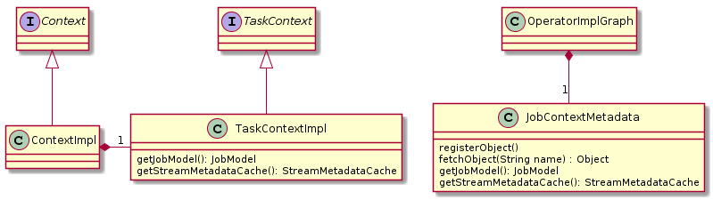

# Report for assignment 4

This is a template for your report. You are free to modify it as needed.
It is not required to use markdown for your report either, but the report
has to be delivered in a standard, cross-platform format.

## Project

Name: Apache Samza

URL: https://github.com/apache/samza

Apache Samza is a distributed stream processing framework. It is a scalable data processing engine that allows
 you to process and analyze your data in real-time. 
    
## Architectural overview and purpose of the system (optional, as one item for P+)
Samza is a data-processing engine that is scalable. The purpose of Samza is that it allows the user to analyze and process the data in real time via streams in a fast non costly way. A stream is simply put a bunch or a collection of messages that cannot be changed. Often the messages are of the same type, or at least in the same category. Streams in Samza can have many people writing to a stream or many people reading from a stream at the same time. Streams are divided into different partitions. When a stream receives a message, the message is distributed to one of the streams partitions. Every message that is distributed to a partition has a unique offset so that each message can uniquely can be identified. Samza could be used for both stateful and stateless data processing. Simply put, stateful processing is when you need to save some state or record of a message after it has been processed in the stream and stateless processing is the opposite when you do not have to keep a record of a state after a message has been processed. Samza has a processing guarantee, which means that each message that enters a stream will be processed at least once. This guarantees that every message will be read, even if there are failures.

Samza uses distributed execution. It first breaks down the application in multiple tasks, each task takes data from one partition of the input streams and the assignment of partitions never change. The task is restarted somewhere else if the machine that the task is on fails, and the task still consumes the same stream partitions. Samza allows tasks to execute independent of each other without sharing any state since there is no ordering of messages across partitions.


Each 	application also has a coordinator which manages the assignment of tasks. The coordinator makes sure that machines are working properly and redistributes tasks if it fails.  

Samza has a very flexible threading model to run each task, you can control the number of workers needed to process your data as well as the number of threads each worker uses to to run its tasks. Each thread can run one or more tasks and tasks don't share any state, thus you don’t have to worry about coordination across threads.

Samza also guarantees that even if your job crashes, the machine dies, there is a network fault, messages won’t be lost. This is done by having each task periodically persisting the last processed offsets for its input partitions. 

Each Samza task is associated with its own instance of a local database (state-store) which allows tasks to be relocated without affecting the overall application. 

Sources
* http://samza.apache.org/learn/documentation/1.0.0/core-concepts/core-concepts.html
* http://samza.apache.org/learn/documentation/1.0.0/architecture/architecture-overview.html

## Selected issue(s)

Title: Refactor TaskContextImpl to not include access to objects that are only used internally

URL: https://issues.apache.org/jira/browse/SAMZA-1935

TaskContext should be a public API but TaskContextImpl is being used to pass around objects for internal use. Some 
internal components cast TaskContext to a TaskContextImpl to access these objects, which is not ideal.

## Onboarding experience

The onboarding documentation is actually very good in this project and can be found in the README.md. We did not have to search for information on a different place to be able to build the project and run tests using gradle.
Gradle was a required tool to build the project. The project specified commands for building the project using gradle as well as where to download gradle if you don’t have it on your local machine.

Samza integrates with YARN for dependency management and running stream-processing as a managed service. Samza works with YARN to distribute resources and it also handles failures of individual instances and automatically restarts them. And scala is a programming language that combines an object oriented approach and functional programming into one high level programming language.

The build as well as the tests conclude without any errors.


## Requirements affected by functionality being refactored

TaskContextImpl was split up by creating a separate object to decouple internally passed around objects from API. 

We created the helper class JobContextMetadata to pass operators internally. 

|  Name | JobContextMetadata | 
|---|---|
|Title| Fetching and assigning register objects|
|Description| A helper class needed to pass operators internally.|

|  Name | registerObject() | 
|---|---|
|Title| register object to registry |
|Description| Takes a string and a object and writes it into the object registry |

|  Name | fetchObject | 
|---|---|
|Title| fetches object from registry|
|Description| Takes a string and object and returns the object from registry|

|  Name | getJobModel | 
|---|---|
|Title| gets job model |
|Description| returns the job model|

|  Name | getStreamMetadataCache | 
|---|---|
|Title|get streamMetadataCache|
|Description| returns streamMetadataCache|

|  Name | TaskContextImpl | 
|---|---|
|Title| Gets context and shares it to all tasks within the container |
|Description| Moved registerObject and fetchObject to not include access to object that are only used internally. getJobModel and getStreamMetadataCache is kept in TaskContextImpl in order to pass them on in the constructor of JobContextMetadata|

## The refactoring carried out
Before the refactoring a [Context](./samza-api/src/main/java/org/apache/samza/context/Context.java) object was given as input to the init method in [OperatorImpl](./samza-core/src/main/java/org/apache/samza/operators/impl/OperatorImpl.java). On this object the method getTaskContext was called which returned a [TaskContext](./samza-api/src/main/java/org/apache/samza/context/TaskContext.java) object. This object was then casted to a [TaskContextImpl](./samza-core/src/main/java/org/apache/samza/context/TaskContextImpl.java) object to be able to use four methods in [TaskContextImpl](./samza-core/src/main/java/org/apache/samza/context/TaskContextImpl.java). This methods do not belong to the public interface and are only used internally, which makes them unfit for [TaskContextImpl](./samza-core/src/main/java/org/apache/samza/context/TaskContextImpl.java). A new class, called [JobContextMetadata](./samza-core/src/main/java/org/apache/samza/context/JobContextMetadata.java) was created, with some of the attributes and methods from [TaskContextImpl](./samza-core/src/main/java/org/apache/samza/context/TaskContextImpl.java). The attributes [JobModel](./samza-core/src/main/java/org/apache/samza/job/model/JobModel.java), [StreamMetadataCache](./samza-core/src/main/scala/org/apache/samza/system/StreamMetadataCache.scala) and Map<String, Object>, and the methods registerObject and fetchObject were moved.
 

The [JobContextMetadata](./samza-core/src/main/java/org/apache/samza/context/JobContextMetadata.java) is instantiated in the OperatorImplGraph and is passed to multiple OperatorImpl.


The class [EmbeddedTaggedRateLimiter](./samza-core/src/main/java/org/apache/samza/util/EmbeddedTaggedRateLimiter.java) implements the public API [RateLimiter](./samza-api/src/main/java/org/apache/samza/util/RateLimiter.java), which has a method called init with a [Context](./samza-api/src/main/java/org/apache/samza/context/Context.java) object as inparameter. This means that the [Context](./samza-api/src/main/java/org/apache/samza/context/Context.java) object is the only source from which the [JobModel](./samza-core/src/main/java/org/apache/samza/job/model/JobModel.java) and the [StreamMetadataCache](./samza-core/src/main/scala/org/apache/samza/system/StreamMetadataCache.scala) can be fetched. Hence, the methods getJobModel and getStreamMetadataCache are needed outside of [JobContextMetadata](./samza-core/src/main/java/org/apache/samza/context/JobContextMetadata.java). Therefore only copies of these methods were moved to [JobContextMetadata](./samza-core/src/main/java/org/apache/samza/context/JobContextMetadata.java).

This means that the [StreamMetadataCache](./samza-core/src/main/scala/org/apache/samza/system/StreamMetadataCache.scala) and the [JobModel](./samza-core/src/main/java/org/apache/samza/job/model/JobModel.java) are created with the Context therefore the JobContextMetadata is initiated with the StreamMetadataCache and JobModel retrieved by calling getJobModel and getStreamMetadataCache on the TaskContextImpl, so there are still casts of the TaskContext to the TaskContextImpl.


After the refractoring, the [JobContextMetadata](
./samza-core/src/main/java/org/apache/samza/context/JobContextMetadata.java) 
object is used when calling fetchObject and getStreamMetadataCache instead in the [OperatorImpl](./samza-core/src/main/java/org/apache/samza/operators/impl/OperatorImpl.java)
The major difference however is that the [TaskContext](./samza-api/src/main/java/org/apache/samza/context/TaskContext.java) 
object received when calling getTaskContext on the [Context](./samza-api/src/main/java/org/apache/samza/context/Context.java) 
object does not have to be casted to a [TaskContextImpl](./samza-core/src/main/java/org/apache/samza/context/TaskContextImpl.java) object.

The patch can be viewed using the following command line: 
```bash
git diff master..testing
```

### Before


### After



## Existing test cases relating to refactored code
Firstly we added a new class `JobContextMetaData` to lift out some functionality from the class `TaskContextImpl`. Then we had to move the testing of this functionality from `TestTaskContextImpl` to a new testclass `TestJobContextMetaData`. In the new testclass, we test to register and fetch an object. So we register an object with a specific key, and we test so that we can fetch this object with that specific key. We also test so that the fetch function returns null if there is no key attached to an object.

We have changed a bit to `TestOperatorImpl`. The context contains `TaskContextImpl` but since we lifted out functionality from the `TaskContextImpl` we had to add this back to the test. We did this by initiating a new `JobContextMetaData` which contains the functionality that we lifted out. So whenever we initiialize the context, we also initialize the JobContextMetaData. The reason why we create the `JobContextMetaData` with null arguments is that before, the testcase used a mock of `TaskContextImpl` without mocking the getters and the getters are obviously not used in this testcase.

The last test we changed was in the `TestWindowOperator` testclass. The reason we changed this was that the mock was not necessary to test this functionality. Before, it worked like this. They initialized their testattributes with some key k1 and tried to retrieve the value with key k2 which does not work, so instead they mocked the fetch object method to pass the test. Now, we have changed the test so that we initialize the test attributes with correct attributes so that we dont need to mock the fetch object method.

To run those three tests, use the following command line:
```bash
./gradlew clean :samza-core:test -Dtest.single=TestJobContextMetadata
./gradlew clean :samza-core:test -Dtest.single=TestOperatorImpl
./gradlew clean :samza-core:test -Dtest.single=TestWindowOperator
```


## Test logs

Build was passing before as one can see in [BEFORE.log](./log/BEFORE.log).

Build is passing after the refractoring as one can see in [AFTER.log](./log/AFTER.log).

One could also look at the Travis builds on `master` (before) and `testing` (after) branches.

## Effort spent

For each team member, how much time was spent in

* Viktor 
    1. Plenary discussions/meetings: 11
    
    2. Choosing project:8
    
    3. Reading documentation:2
    
    4. Setting up environment:1
    
    5. Analyzing code:5
    
    6. Writing documentation:2 
    
    7. Writing code:1
    
* Cyril 
    1. Plenary discussions/meetings: 11
    
    2. Choosing project: 8
    
    3. Reading documentation: 1
    
    4. Setting up environment: 1 
    
    5. Analyzing code: 5
    
    6. Writing documentation: 2 
    
    7. Writing code: 8
    
* Robin 
    1. Plenary discussions/meetings: 10
    
    2. Choosing project: 8
    
    3. Reading documentation: 2
    
    4. Setting up environment: 1
    
    5. Analyzing code: 5
    
    6. Writing documentation: 3
    
    7. Writing code: 1
    
* Sara 
    1. Plenary discussions/meetings:
    
    2. Choosing project:
    
    3. Reading documentation:
    
    4. Setting up environment:
    
    5. Analyzing code:
    
    6. Writing documentation:
    
    7. Writing code:
    
* Fredrik 
    1. Plenary discussions/meetings:
    
    2. Choosing project:
    
    3. Reading documentation:
    
    4. Setting up environment:
    
    5. Analyzing code:
    
    6. Writing documentation:
    
    7. Writing code:

## Overall experience
Finding a suitable project that seemed doable was not a trivial task. After finding the Samza project and building it, understanding the project and the requirements of the refactoring was quite a challenge. 
We spent a lot of time as a group discussing how to best approach the problem and if our proposed solutions would work. We learnt that a seemingly trivial refactoring problem could in fact be much harder than it looked in the beginning. More time that expected was spent trying to find a solution without any code being written. 

Furthermore we learned that additional dependencies could be found within our project which would further complicate the refactoring. The experience of the given documentation was overall good, for example it was easy to build the project based on the documentation in the README.md. If anything was unclear, additional information could be found on their website: http://samza.apache.org/ 

We reached out to the community of the project in order to register as an assignee and within a day we were able to connect with the issue reporter (Cameron Lee). He seemed glad that we showed interest in the project and referred to Yi Pan who was able to register us on the project. The conversation can be found in the comment section: https://issues.apache.org/jira/browse/SAMZA-1935


Fredrik:

Viktor:This assignment has taught me that to fully understand the scope of a project, you need more time that I previously though. It took a long time finding a suitable project and then uderstanding it before actually starting the refactoring. 

Sara:


Robin: I've learned it takes a long time to find a suitable project for this kind of task. There is a lot of code to read to get up to speed and realize how big the task actually is.
